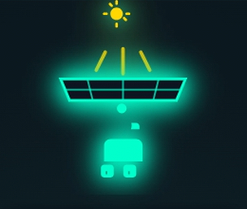
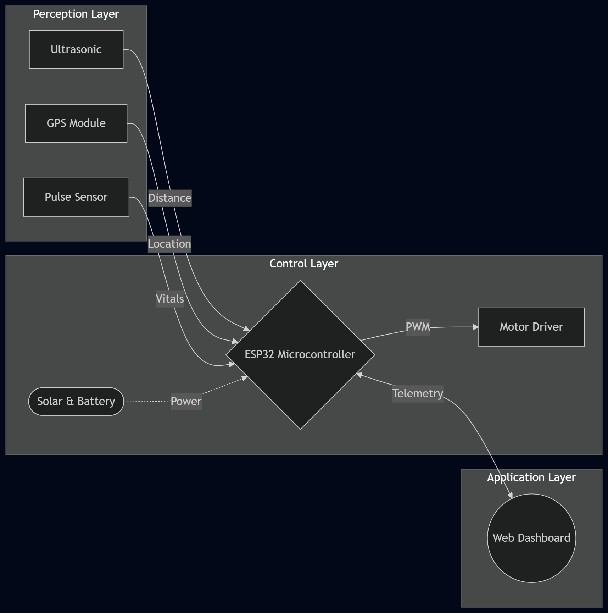
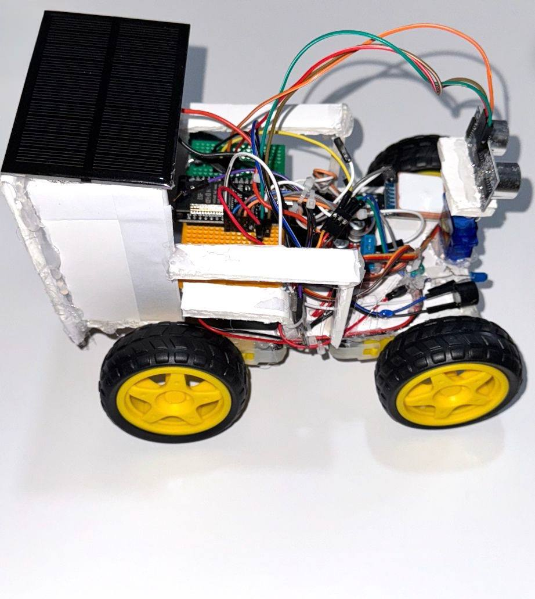
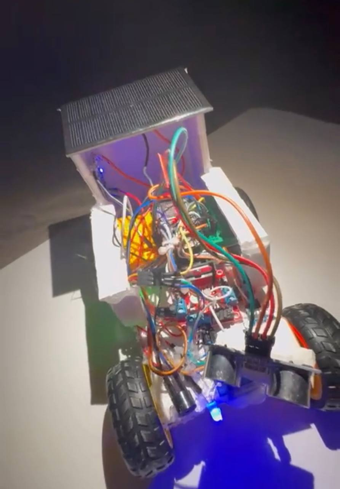

<div align="center">

  <h1> IoT-Enabled Solar-Powered Smart Wheelchair</h1>

  <a href="assets/images/project_logo.png" target="_blank"></a><br><a href="https://isocpp.org/" target="_blank"></a><a href="https://www.arduino.cc/en/software" target="_blank"></a><a href="https://www.espressif.com/en/products/socs/esp32" target="_blank"></a><a href="https://github.com/MansourMutlaq/IoT-Smart-Wheelchair"></a><a href="https://www.vision2030.gov.sa/" target="_blank"></a>

  <p style="color: #c9d1d9; font-size: 1.1em; line-height: 1.6; margin-top: 12px; margin-bottom: 0;">
    An innovative IoT system combining autonomous mobility capabilities with ESP32's powerful processing<br>
    for real-time health monitoring via a <b style="color: #58a6ff;">Secure Local Edge Node</b> without internet dependency.
  </p>

</div>


###  Core Capabilities

*  **Autonomous Avoidance:** Real-time obstacle detection and navigation using Ultrasonic sensors.
*  **Live Telemetry & Tracking:** Continuous monitoring of vital signs and precise GPS positioning.
*  **Edge Computing:** Powered by ESP32 for secure, offline local network control.
*  **Sustainable Power:** Integrated solar charging system for extended operational time.
  
---


## Key Features

- **Smart Navigation:** Real-time obstacle avoidance using Ultrasonic sensors and Servo scanning.
- **Secure Connectivity:** Standalone WPA2-encrypted Access Point (AP) for off-grid operations.
- **Live Telemetry:** Web-based dashboard for heart rate, GPS coordinates, and system status.
- **Emergency SOS:** Instant alarm and GPS location sharing for rapid emergency response.
- **Sustainable Energy:** Solar-powered battery management for extended range.

---


## Security & Network Infrastructure (CIA Triad Focus)

As an Information Technology project, the architecture was built on core security principles to ensure a robust **Secure Edge Node**:

* **Network Hardening:** Established a standalone, WPA2-PSK encrypted local network to isolate control traffic. This eliminates external "Man-in-the-Middle" (MitM) risks.
* **High Availability (Heartbeat):** Implemented a custom Heartbeat protocol between the UI and ESP32. If the link is severed, the system triggers an immediate emergency halt, protecting against physical DoS (Denial of Service) scenarios.
* **Data Integrity:** Used Non-blocking Asynchronous communication to ensure telemetry data (GPS, Pulse) is delivered accurately without interfering with the motor control loops.

---


### System Architecture

The system follows a modular architecture consisting of three main layers, seamlessly integrated for real-time edge computing:



---


## Core Hardware Architecture

The system's intelligence is powered by the **ESP32 Microcontroller**, ensuring real-time edge computing, secure local network hosting, and seamless sensor integration.

| Component | Function in System |
| :--- | :--- |
| **ESP32 Board** | Core processing, Local Wi-Fi AP setup, and Web Server hosting. |
| **Ultrasonic Sensors** | Forward obstacle detection and autonomous emergency braking. |
| **GPS Module** | Real-time geographic location tracking for the telemetry dashboard. |
| **Solar Panel System** | Sustainable battery charging for extended operational range. |
| **Motor Drivers** | Translating digital logic signals into mechanical chair movement. |

---


<a id="gallery"></a>
##  Hardware Prototype & Build

The wheelchair prototype is built with a custom-engineered structure, integrated components, and sustainable power management.

<div align="center">
  <table width="100%" style="border-collapse: collapse; table-layout: fixed; border: none;">
    
  <tr>
      <td width="50%" align="center" style="padding: 10px; vertical-align: top;">
        <a href="assets/images/prototype_overview.jpg" target="_blank">
          
        </a>
      </td>
      <td width="50%" align="center" style="padding: 10px; vertical-align: top;">
        <a href="assets/images/solar_integration.jpg" target="_blank">
          
        </a>
      </td>
    </tr>

  <tr>
      <td align="center" style="padding: 5px;"><b>Final Prototype (Overview)</b></td>
      <td align="center" style="padding: 5px;"><b>Solar Power (Integration)</b></td>
    </tr>

  <tr>
      <td align="center" style="padding: 5px; vertical-align: top; color: #8b949e;">
        <i>Custom-engineered chassis for stability and modular access.</i>
      </td>
      <td align="center" style="padding: 5px; vertical-align: top; color: #8b949e;">
        <i>Sustainable energy harvesting circuit for power management.</i>
      </td>
    </tr>

  <tr>
      <td align="center" style="padding: 15px;">
        <code style="color: #58a6ff;">[ Custom Chassis • Stability ]</code>
      </td>
      <td align="center" style="padding: 15px;">
        <code style="color: #58a6ff;">[ Solar Integration • Power ]</code>
      </td>
    </tr>

  </table>
</div>

---


<div align="center">
  <h3>  Prototype Mobility & UI Navigation</h3>
  
  <table style="width: 100%; max-width: 850px; border-collapse: collapse; border: 1px solid #30363d; background-color: #010409;">
    <tr>
      <td width="50%" align="center" style="border: 1px solid #30363d; padding: 0;">
        
      </td>
      <td width="50%" align="center" style="border: 1px solid #30363d; padding: 0;">
        
      </td>
    </tr>

  <tr>
      <td align="center" style="border: 1px solid #30363d; padding: 15px; background-color: #0d1117;">
        <b style="color: #c9d1d9; font-size: 16px;">Hardware Actuation & Movement</b>
      </td>
      <td align="center" style="border: 1px solid #30363d; padding: 15px; background-color: #0d1117;">
        <b style="color: #c9d1d9; font-size: 16px;">Dashboard Interface Responsiveness</b>
      </td>
    </tr>

  <tr>
      <td align="center" style="border: 1px solid #30363d; padding: 15px; background-color: #0d1117;">
        <span style="color: #8b949e; font-size: 14px;"><i>Demonstrating physical response<br>and mobility</i></span><br><br>
        <code style="color: #58a6ff; font-size: 13px;">[ ESP32 • PWM Control ]</code>
      </td>
      <td align="center" style="border: 1px solid #30363d; padding: 15px; background-color: #0d1117;">
        <span style="color: #8b949e; font-size: 14px;"><i>Real-time telemetry<br>and UI navigation</i></span><br><br>
        <code style="color: #58a6ff; font-size: 13px;">[ HTML/JS • MQTT ]</code>
      </td>
    </tr>
  </table>
</div>

---


<div align="center">

  <h2> System Interface & Failsafe Controls</h2>
  <p style="line-height: 1.6; color: #c9d1d9;">
    <i>A secure, edge-to-client mobile interface featuring an <b>Auto-Triggered Red Failsafe Mode</b>. 
    In the event of network disconnection, the UI instantly alerts the patient visually and halts operations, 
    ensuring maximum wheelchair safety and reliability.</i>
  </p>

  <table style="width: 100%; max-width: 900px; border-collapse: collapse; border: none;">
    <tr>
      <td colspan="3" align="center" style="padding: 0px;">
        
      </td>
    </tr>
    <tr align="center" style="height: 60px;">
      <td width="33%" style="padding-top: 15px;">
        <b style="color: #ffffff;">Main Dashboard</b><br>
        <sub style="color: #8b949e;">Real-time monitoring</sub>
      </td>
      <td width="33%" style="padding-top: 15px;">
        <b style="color: #e3b341;">Directional Control</b><br>
        <sub style="color: #8b949e;">Manual overrides</sub>
      </td>
      <td width="33%" style="padding-top: 15px;">
        <b style="color: #da3633;">Emergency Protocols</b><br>
        <sub style="color: #8b949e;">Instant failsafe</sub>
      </td>
    </tr>
  </table>

</div>

---


<div align="center">
  <h3>🔊 Live SOS Alarm Demonstration</h3>
</div>

<br>

https://github.com/user-attachments/assets/666d7f2d-7b0d-473f-8da0-fd3de3a02369

<br>

<div align="center">
  <h4>Bridging Digital Monitoring with Physical Safety</h4>
  <p style="color: #c9d1d9; font-style: italic; max-width: 700px; line-height: 1.6;">
    This demonstration showcases the system's active emergency response. Upon triggering the SOS protocol via the dashboard, the ESP32 instantaneously activates a high-decibel onboard buzzer. This critical failsafe ensures immediate physical-world intervention by notifying bystanders during sudden medical crises.
  </p>
  <br>
  
  
  &nbsp;&nbsp;
  
  &nbsp;&nbsp;
  
  
  <br><br>
</div>

---


## System Logic & Control Flow

The wheelchair employs a "Sense-Think-Act" cycle to ensure user safety:
- **Distance > 40cm:** Normal operation (Manual control via Dashboard).
- **Distance 25cm - 40cm:** Warning state (Buzzer alert + Speed reduction).
- **Distance < 25cm:** Critical state (**Auto-stop + Smart Avoidance Algorithm activated**).

---


## Engineering Challenges & Strategic Solutions

Throughout the development phase, several technical hurdles were addressed to ensure system stability:
* **Asynchronous Concurrency:** Managed simultaneous sensor data polling (Ultrasonic & GPS) while maintaining a responsive Web Server on the ESP32. Solved by utilizing non-blocking programming (avoiding `delay()`) to prevent CPU hangs.
* **Network Reliability:** Designed the custom "Heartbeat" failsafe to trigger an emergency stop if the connection between the controller and the Edge Node is severed.
* **Power Management:** Integrated solar charging logic to maintain stable voltage for the ESP32 and motor drivers, balancing the variable output from solar panels.
* **System Stability:** Implemented a **Hardware Watchdog Timer (WDT)** to ensure the ESP32 recovers automatically from any software anomalies.

---


## Getting Started

### Prerequisites
- **Hardware:** ESP32 Dev Board, L298N Driver, HC-SR04, NEO-6M GPS, Pulse Sensor.
- **Software:** Arduino IDE with ESP32 Board Support.
- **Libraries:** `ESPAsyncWebServer`, `ESP32Servo`, `TinyGPS++`.

### Installation & Setup
1. **Clone the Repo:**
```bash
git clone [https://github.com/MansourMutlaq/IoT-Smart-Wheelchair.git](https://github.com/MansourMutlaq/IoT-Smart-Wheelchair.git)
cd IoT-Smart-Wheelchair
```

2. **Flash the Code:**
```bash
# Upload 'firmware/Smart_Wheelchair_Edge_Node.ino' to your ESP32 using Arduino IDE
```

3. **Connect to WiFi:**
```text
SSID: IoT-Enabled Solar Wheelchair
Pass: Safe@Wheel2030
```

4. **Access Dashboard:**
```text
Open your browser and navigate to: [http://192.168.4.1](http://192.168.4.1)
```


---

### 📂 Repository Structure

```text
IoT-Smart-Wheelchair/
├── assets/
│   ├── images/            # UI screenshots, hardware photos, and GIFs
│   └── videos/            # Project video clips and demonstrations
├── docs/                  # Full technical project report (.pdf)
├── firmware/              # ESP32 source code (.ino) and libraries
├── .gitignore             # Ignored files for Git
├── LICENSE                # MIT License file
└── README.md              # Project documentation (this file)
```

## Future Roadmap (Scalability & Security)

To transition this project from a prototype to an enterprise-grade IoT solution, the following enhancements are planned:

### Advanced Security & Connectivity
* **Cloud Integration (IoT Hub):** Migrating from a local Edge Node to a centralized Cloud environment (Azure IoT or AWS IoT) for remote monitoring and long-term data analytics.
* **Encrypted Telemetry:** Implementing TLS/SSL encryption for all data packets sent between the wheelchair and the dashboard to ensure patient data privacy.
* **5G/LTE Expansion:** Integrating a GSM/LTE module for ubiquitous connectivity, moving beyond the limitations of local WiFi range.

### Intelligent Navigation
* **AI-Powered Obstacle Detection:** Replacing ultrasonic sensors with an AI-enabled camera (Computer Vision) for advanced terrain recognition and dynamic object avoidance.

---

###  Project Documentation
For an in-depth analysis of the system architecture, hardware design, and implementation details, you can access the full technical report here:

<div align="center">

[](https://raw.githubusercontent.com/MansourMutlaq/IoT-Smart-Wheelchair/main/docs/IoT_Enabled_Solar_Powered_Smart_Wheelchair.pdf)

</div>

---


## 👥 Project Team & Academic Context

Developed at **Qassim University** (Department of Information Technology) <br>

**Final Grade:** A+ 

###  Lead Systems Engineer & Full-Stack Developer
* **[Mansour Mutlaq Alharbi](https://www.linkedin.com/in/mansour-alharbi-129407350)**
  * **System Architecture:** Architected the end-to-end IoT system, bridging hardware sensors with a robust edge-computing firmware.
  * **Core Development:** Developed custom ESP32 firmware and autonomous navigation algorithms to ensure real-time obstacle avoidance.
  * **Full-Stack Deployment:** Deployed a responsive, real-time telemetry web dashboard to monitor system health and patient vitals.
###  Academic & Research Contributors
* **Saud Faisal Alfadda:** Research & Technical Presentation.
* **Meshari Abdullah Alsaegh:** Project Documentation & Academic Deliverables.

###  Academic Supervision
* **Dr. Salim El-Khediri**

---


## 📝 License

This project is licensed under the MIT License - see the [LICENSE](LICENSE) file for details.

---


## 📫 Let's Connect

Whether you're interested in collaborating, have questions about the hardware integration, or want to discuss innovative IoT solutions—feel free to open an Issue or reach out directly!

<div align="center">

  <a href="https://mail.google.com/mail/?view=cm&fs=1&to=mansour-alharbi@outlook.com" target="_blank"></a>
  <a href="https://outlook.live.com/mail/0/deeplink/compose?to=mansour-alharbi@outlook.com" target="_blank"></a>
  <a href="mailto:mansour-alharbi@outlook.com"></a>
  <a href="https://www.linkedin.com/in/mansour-alharbi-129407350" target="_blank"></a>

  <br><br>
  
  <p style="color: #8b949e; font-size: 0.9em;">
    Or drop a message at: <b>mansour-alharbi@outlook.com</b>
  </p>

</div>

---

<div align="center">
<i>"Innovating for a sustainable and inclusive future, in alignment with Saudi Vision 2030."</i>
</div>
