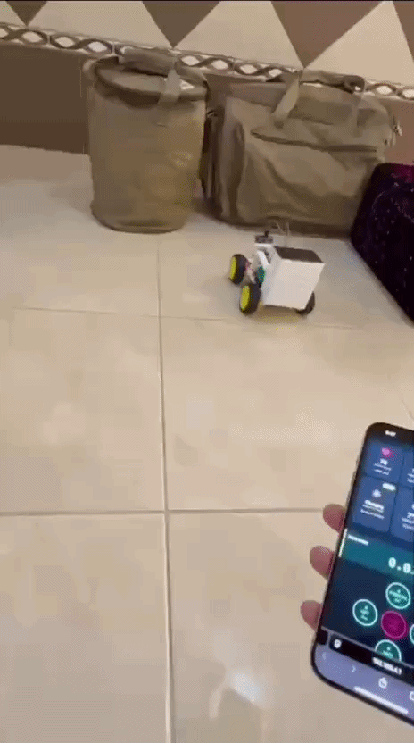
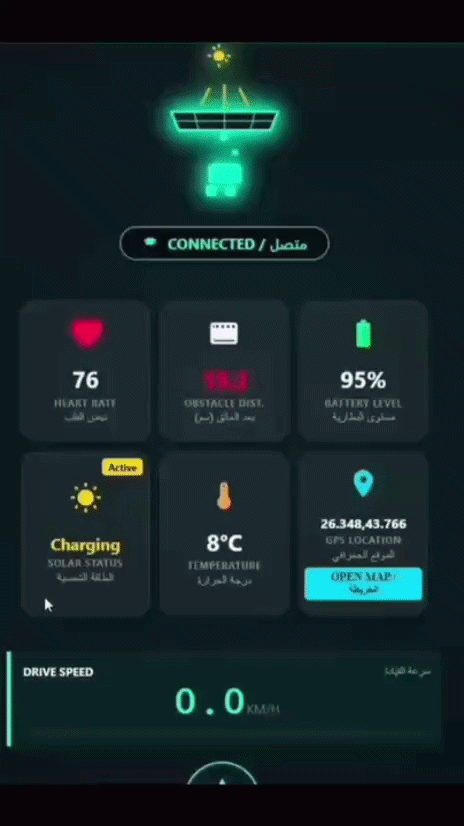
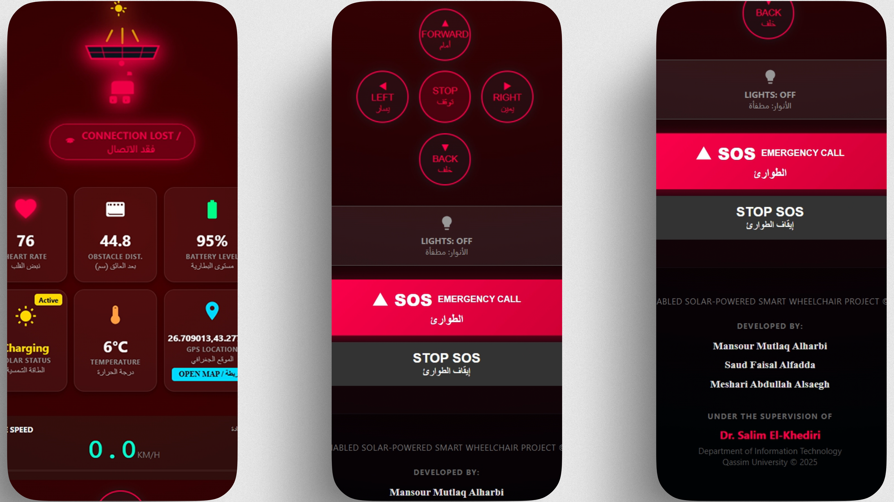

<div align="center">

# IoT-Enabled Solar-Powered Smart Wheelchair

<a id="gallery"></a>

<a href="assets/images/project_logo.png" target="_blank">
  
</a>
<br>

  <a href="https://github.com/MansourMutlaq/IoT-Smart-Wheelchair/tree/main/firmware" target="_blank"></a> <a href="https://github.com/MansourMutlaq/IoT-Smart-Wheelchair/tree/main/firmware" target="_blank"></a> <a href="https://github.com/MansourMutlaq/IoT-Smart-Wheelchair/tree/main/firmware" target="_blank"></a> <a href="https://github.com/MansourMutlaq/IoT-Smart-Wheelchair/tree/main/docs" target="_blank"></a> <a href="https://www.vision2030.gov.sa/" target="_blank"></a>

<br><br>

<b>An innovative IoT system designed for autonomous mobility and real-time health monitoring.</b><br>
<i>This project serves as a <b>Secure Local Edge Node</b>, processing sensor data and providing a web-based dashboard without external internet dependency, ensuring privacy and high reliability for users.</i>

</div>

<br><br>

### Core Capabilities

* **Autonomous Avoidance:** Real-time obstacle detection and navigation using Ultrasonic sensors.
* **Live Telemetry & Tracking:** Continuous monitoring of vital signs and precise GPS positioning.
* **Edge Computing:** Powered by ESP32 for secure, offline local network control.
* **Sustainable Power:** Integrated solar charging system for extended operational time.

---


## Key Features

- **Smart Navigation:** Real-time obstacle avoidance using Ultrasonic sensors and Servo scanning.
- **Secure Connectivity:** Standalone WPA2-encrypted Access Point (AP) for off-grid operations.
- **Live Telemetry:** Web-based dashboard for heart rate, GPS coordinates, and system status.
- **Emergency SOS:** Instant alarm and GPS location sharing for rapid emergency response.
- **Sustainable Energy:** Solar-powered battery management for extended range.

---

## Security & Network Infrastructure (CIA Triad Focus)

As an Information Technology project, the architecture was built on core security principles to ensure a robust **Secure Edge Node**:

* **Network Hardening:** Established a standalone, WPA2-PSK encrypted local network to isolate control traffic. This eliminates external "Man-in-the-Middle" (MitM) risks.
* **High Availability (Heartbeat):** Implemented a custom Heartbeat protocol between the UI and ESP32. If the link is severed, the system triggers an immediate emergency halt, protecting against physical DoS (Denial of Service) scenarios.
* **Data Integrity:** Used Non-blocking Asynchronous communication to ensure telemetry data (GPS, Pulse) is delivered accurately without interfering with the motor control loops.

---

### System Architecture

The system follows a modular architecture consisting of three main layers, seamlessly integrated for real-time edge computing:

```mermaid
flowchart LR
    subgraph Perception Layer
        US[Ultrasonic]
        GPS[GPS Module]
        Pulse[Pulse Sensor]
    end

    subgraph Control Layer
        PWR([Solar & Battery])
        ESP{ESP32 Microcontroller}
        MD[Motor Driver]
    end

    subgraph Application Layer
        UI((Web Dashboard))
    end

    US -->|Distance| ESP
    GPS -->|Location| ESP
    Pulse -->|Vitals| ESP
    PWR -.->|Power| ESP
    ESP -->|PWM| MD
    ESP <-->|Telemetry| UI
 ```

## Core Hardware Architecture

The system's intelligence is powered by the **ESP32 Microcontroller**, ensuring real-time edge computing, secure local network hosting, and seamless sensor integration.

| Component | Function in System |
| :--- | :--- |
| **ESP32 Board** | Core processing, Local Wi-Fi AP setup, and Web Server hosting. |
| **Ultrasonic Sensors** | Forward obstacle detection and autonomous emergency braking. |
| **GPS Module** | Real-time geographic location tracking for the telemetry dashboard. |
| **Solar Panel System** | Sustainable battery charging for extended operational range. |
| **Motor Drivers** | Translating digital logic signals into mechanical chair movement. |

---


<a id="gallery"></a>
## Hardware Prototype & Build

The wheelchair Prototype is built with a custom-engineered structure, integrated components, and sustainable power management.

<div align="center">
<table>
<tr>
<td align="center">
  <a href="assets/images/prototype_overview.jpg" target="_blank">
    
  </a>
</td>
<td align="center">
  <a href="assets/images/solar_integration.jpg" target="_blank">
    
  </a>
</td>
</tr>
<tr>
<td align="center"><b>Final Prototype (Overview)</b></td>
<td align="center"><b>Solar Power (Integration)</b></td>
</tr>
</table>
</div>

---


<div align="center">

<h3> Prototype Mobility & UI Navigation Tests</h3>

<table>
  <tr>
    <td align="center">
      
    </td>
    <td align="center">
      
    </td>
  </tr>
  <tr>
    <td align="center">
      <b>Hardware Actuation & Movement</b><br>
      <i>Demonstrating the physical response and mobility of the wheelchair prototype.</i>
    </td>
    <td align="center">
      <b>Dashboard Interface Responsiveness</b><br>
      <i>Real-time testing of the web-based UI controls and telemetry display.</i>
    </td>
  </tr>
</table>

</div>

---


<div align="center">
  <h2> System Interface & Failsafe Controls</h2>
  <p><i>A secure, edge-to-client mobile interface featuring an <b>Auto-Triggered Red Failsafe Mode</b>. In the event of network disconnection, the UI instantly alerts the patient visually and halts operations, ensuring maximum wheelchair safety and reliability.</i></p>

  <table align="center">
    <tr>
      <td colspan="3" align="center" style="padding: 0px;">
        
      </td>
    </tr>
    <tr align="center">
      <td width="33%">
        <b>Main Dashboard</b><br>
        <sub>Real-time monitoring</sub>
      </td>
      <td width="33%">
        <b>Directional Control</b><br>
        <sub>Manual overrides</sub>
      </td>
      <td width="33%">
        <b>Emergency Protocols</b><br>
        <sub>Instant failsafe</sub>
      </td>
    </tr>
  </table>
  
</div>

---


<div align="center">

<h3>🔊 Live SOS Alarm Demonstration</h3>

<table width="800">
  <tr>
    <td align="center">
      <video src="https://github.com/user-attachments/assets/666d7f2d-7b0d-473f-8da0-fd3de3a02369" width="100%" controls></video>
    </td>
  </tr>
  <tr>
    <td align="center">
      <b>Bridging Digital Monitoring with Physical Safety</b><br>
      <i>This demonstration showcases the system's active emergency response. Upon triggering the SOS protocol via the dashboard, the ESP32 instantaneously activates a high-decibel onboard buzzer. This critical failsafe ensures immediate physical-world intervention by notifying bystanders during sudden medical crises (e.g., hypoglycemia or fainting).</i>
    </td>
  </tr>
</table>

</div>

---
## System Logic & Control Flow

The wheelchair employs a "Sense-Think-Act" cycle to ensure user safety:
- **Distance > 40cm:** Normal operation (Manual control via Dashboard).
- **Distance 25cm - 40cm:** Warning state (Buzzer alert + Speed reduction).
- **Distance < 25cm:** Critical state (**Auto-stop + Smart Avoidance Algorithm activated**).

---

## Engineering Challenges & Strategic Solutions

Throughout the development phase, several technical hurdles were addressed to ensure system stability:
* **Asynchronous Concurrency:** Managed simultaneous sensor data polling (Ultrasonic & GPS) while maintaining a responsive Web Server on the ESP32. Solved by utilizing non-blocking programming (avoiding `delay()`) to prevent CPU hangs.
* **Network Reliability:** Designed the custom "Heartbeat" failsafe to trigger an emergency stop if the connection between the controller and the Edge Node is severed.
* **Power Management:** Integrated solar charging logic to maintain stable voltage for the ESP32 and motor drivers, balancing the variable output from solar panels.
* **System Stability:** Implemented a **Hardware Watchdog Timer (WDT)** to ensure the ESP32 recovers automatically from any software anomalies.

---

## Getting Started

### Prerequisites
- **Hardware:** ESP32 Dev Board, L298N Driver, HC-SR04, NEO-6M GPS, Pulse Sensor.
- **Software:** Arduino IDE with ESP32 Board Support.
- **Libraries:** `ESPAsyncWebServer`, `ESP32Servo`, `TinyGPS++`.

### Installation & Setup
1. **Clone the Repo:**
```bash
git clone [https://github.com/MansourMutlaq/IoT-Smart-Wheelchair.git](https://github.com/MansourMutlaq/IoT-Smart-Wheelchair.git)
cd IoT-Smart-Wheelchair
```

2. **Flash the Code:**
```bash
# Upload 'firmware/Smart_Wheelchair_Edge_Node.ino' to your ESP32 using Arduino IDE
```

3. **Connect to WiFi:**
```text
SSID: IoT-Enabled Solar Wheelchair
Pass: Safe@Wheel2030
```

4. **Access Dashboard:**
```text
Open your browser and navigate to: [http://192.168.4.1](http://192.168.4.1)
```


---

### 📂 Repository Structure

```text
IoT-Smart-Wheelchair/
├── assets/
│   ├── images/            # UI screenshots, hardware photos, and GIFs
│   └── videos/            # Project video clips and demonstrations
├── docs/                  # Full technical project report (.pdf)
├── firmware/              # ESP32 source code (.ino) and libraries
├── .gitignore             # Ignored files for Git
├── LICENSE                # MIT License file
└── README.md              # Project documentation (this file)
```

## Future Roadmap (Scalability & Security)

To transition this project from a prototype to an enterprise-grade IoT solution, the following enhancements are planned:

### Advanced Security & Connectivity
* **Cloud Integration (IoT Hub):** Migrating from a local Edge Node to a centralized Cloud environment (Azure IoT or AWS IoT) for remote monitoring and long-term data analytics.
* **Encrypted Telemetry:** Implementing TLS/SSL encryption for all data packets sent between the wheelchair and the dashboard to ensure patient data privacy.
* **5G/LTE Expansion:** Integrating a GSM/LTE module for ubiquitous connectivity, moving beyond the limitations of local WiFi range.

### Intelligent Navigation
* **AI-Powered Obstacle Detection:** Replacing ultrasonic sensors with an AI-enabled camera (Computer Vision) for advanced terrain recognition and dynamic object avoidance.

---


### 📚 Project Documentation
For an in-depth analysis of the system architecture, hardware design, and implementation details, you can access the full technical report here:

<div align="center">
  <a href="docs/IoT_Enabled_Solar_Powered_Smart_Wheelchair.pdf">
    
  </a>
</div>

---


## 👥 Project Team & Academic Context

Developed at **Qassim University** (Department of Information Technology) <br>

**Final Grade:** A+ 

### 💻 Lead Systems Engineer & Full-Stack Developer
* **[Mansour Mutlaq Alharbi](https://www.linkedin.com/in/mansour-alharbi-129407350)**
  * **System Architecture:** Architected the end-to-end IoT system, bridging hardware sensors with a robust edge-computing firmware.
  * **Core Development:** Developed custom ESP32 firmware and autonomous navigation algorithms to ensure real-time obstacle avoidance.
  * **Full-Stack Deployment:** Deployed a responsive, real-time telemetry web dashboard to monitor system health and patient vitals.
### 📑 Academic & Research Contributors
* **Saud Faisal Alfadda:** Research & Technical Presentation.
* **Meshari Abdullah Alsaegh:** Project Documentation & Academic Deliverables.

### 🎓 Academic Supervision
* **Dr. Salim El-Khediri**

---

## 📝 License

This project is licensed under the MIT License - see the [LICENSE](LICENSE) file for details.

---

---

## 📫 Let's Connect

Interested in collaborating, have questions about the hardware integration, or want to discuss IoT solutions? Feel free to open an Issue or reach out directly!

<div align="center">
  <a href="mailto:mansour-alharbi@outlook.com">
    
  </a>
  <a href="https://www.linkedin.com/in/mansour-alharbi-129407350" target="_blank">
    
  </a>
</div>

---
<div align="center">
<i>"Innovating for a sustainable and inclusive future, in alignment with Saudi Vision 2030."</i>
</div>
